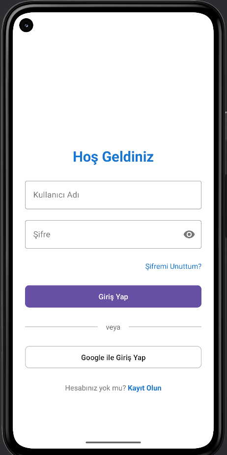
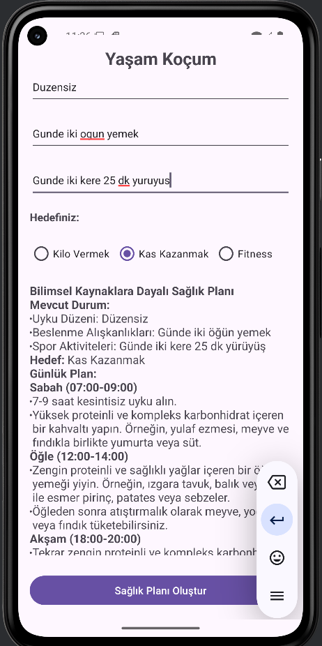

# YasamKocu

**YasamKocu**, bireylerin hedeflerine ulaşmalarına ve yaşam kalitelerini artırmalarına yardımcı olan bir dijital koçluk uygulamasıdır. Bu proje Kotlin ile geliştirilmiştir.

## Özellikler
- Kullanıcı dostu arayüz
- Kişisel hedef belirleme ve izleme
- Veri analizi ve raporlama

## Ekran Görüntüleri

### Giriş Sayfası


### Ana Sayfa


## Kurulum

1. Bu projeyi klonlayın:
    ```bash
    git clone https://github.com/kullanici/YasamKocu.git
    ```

2. Proje dizinine gidin:
    ```bash
    cd YasamKocu
    ```

3. Kotlin'i ve Gradle'ı yüklediğinizden emin olun. [Kotlin](https://kotlinlang.org/) ve [Gradle](https://gradle.org/) yüklemek için ilgili talimatları takip edebilirsiniz.

4. Gradle ile projeyi çalıştırın:
    ```bash
    ./gradlew run
    ```

## Proje Yapısı

- **`src/main/kotlin`**: Ana kaynak dosyaları.
- **`src/test/kotlin`**: Test dosyaları.
- **`build.gradle.kts`**: Gradle yapılandırma dosyası.
